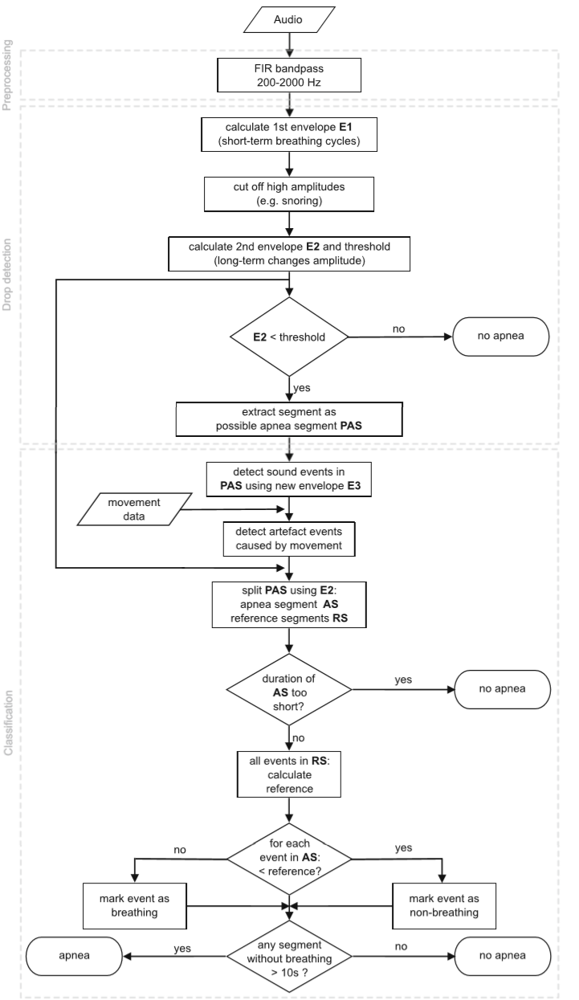
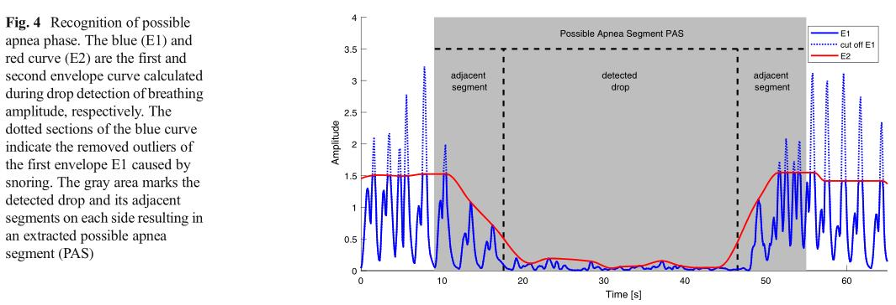

# ApneaDetection_by_Breath in python

This code is based on the algorithm described in the following papers with some improvements.   
If you want use this code, please cite the paper:  
@article{2018Apnea,
  title={Apnea and heart rate detection from tracheal body sounds for the diagnosis of sleep-related breathing disorders},  
  author={ Kalkbrenner, Christoph  and  Eichenlaub, Manuel  and Stefan Rüdiger and  Kropf-Sanchen, Cornelia  and  Rottbauer, Wolfgang  and  Brucher, Rainer },  
  journal={Medical & Biological Engineering & Computing},  
  volume={56},  
  number={4},  
  pages={671-681},  
  year={2018},  
}

The algorithm is as follows：

1.	数据预处理  
  a)	去除任何心音和噪音，并产生一个主要包含呼吸音的信号  
  b)	使用200-2000Hz之间的FIR带通滤波器  
  c)	为了消除背景噪声对安静呼吸声检测的影响，采用谱减法滤波技术  
2.	降低检测  
  a)	阶段目标：扫描整个信号呼吸音振幅的下降，识别出可能的呼吸暂停信号  
  b)	首先，计算预处理后短时窗口内音频信号的平均强度，提取代表每个呼吸周期的包络曲线E1  
    i.	短时窗口：每个点，论文中麦克风为5kHz  
    ii.	用来画呼吸线  
  c)	使用一个长期窗口标准差计算的自适应阈值来切断由于打鼾带来的离群值  
    i.	我们的数据集是30s，长期窗口标准差可以设置为30s  
  d)	通过在第一包络线E1中插值单次呼吸周期的局部最大值来使用分段三次Her-mite插值实现E2包络线  
    i.	E2包络线就是取E1最大值点平滑连接  
  e)	自适应阈值之下的E2包络线的所有信号片段被识别为呼吸幅度下降  
  f)	最终，这些点和他们直接相邻的片段被提取为可能的呼吸暂停片段。   
  
3.	分类  
  a)	上一节处理后的音频信号被分为短期窗口，现在通过计算强度来提取包络E3  ，其中E为包络强度，N为窗口中的样本数量，Xi是窗口中的第i个样本。  
  b)	对包络曲线E3施加一个截止频率为2Hz的低通滤波器，计算一个可变阈值，E3中所有超过这个阈值的环节都被归类为声音事件  
  c)	从运动测量单元数据中提取的运动信号用于识别由运动伪影引起的噪声。这里，活动超过定义的阈值的事件被标记为运动伪影噪声  
  d)	通过对来自降低检测的第二个长期包络曲线E2再次采用简单的阈值操作来完成的。所有低于该阈值的段现在被定义为呼吸暂停段，所有超过该阈值的段被定义为参考段。如果呼吸暂停段持续时间太短，整个段被归类为非呼吸暂停，不做进一步分析；否则将声音时间分为所谓的AS（呼吸暂停段）和RS（非呼吸暂停段）事件，继续处理。  
  e)	随后，正常呼吸的参考水平通过所有RS事件(除噪声事件引起的异常值外)特征值的中值来计算。与平均值相比，这使得参考值对打鼾引起的偶然异常值更为稳健。  
  f)	最后，任何没有呼吸的阶段(没有检测到声音事件或所有AS事件归类为无呼吸)超过10秒的时间被标记为呼吸暂停阶段。   
  
  

